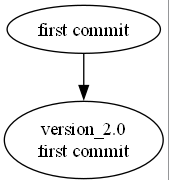
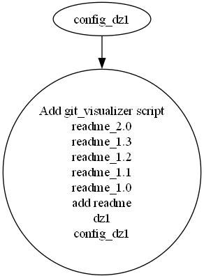

# ДОМАШНЯЯ РАБОТА ПО КОНФИГУРАЦИОННОМУ УПРАЛВЛЕНИЮ №2 ЧУМАКОВ С.Ю. ИКБО-43-23 #

# GIT ViSUALIZER #

Вариант №30: РРазработать инструмент командной строки для визуализации графа
зависимостей, включая транзитивные зависимости. Сторонние средства для
получения зависимостей использовать нельзя.

Зависимости определяются для git-репозитория. Для описания графа
зависимостей используется представление PlantUML. Визуализатор должен
выводить результат на экран в виде графического изображения графа.

Построить граф зависимостей для коммитов, в узлах которого содержатся
номера коммитов в хронологическом порядке. Граф необходимо строить для тега
с заданным именем.

Ключами командной строки задаются:
• Путь к программе для визуализации графов.
• Путь к анализируемому репозиторию.
• Имя тега в репозитории.
Все функции визуализатора зависимостей должны быть покрыты тестами.

**1. ОБЩЕЕ ОПИСАНИЕ.**

Git Dependency Visualizer — это инструмент командной строки, предназначенный для визуализации графа зависимостей Git-коммитов. Основные особенности:

Автоматическое построение графа зависимостей коммитов для указанного тега.
Генерация графа в формате PlantUML.
Визуализация графа в графическом виде (PNG).
Полное покрытие функционала тестами.
Программа подходит для анализа истории коммитов в Git-репозиториях, где важно изучить зависимости между коммитами.

**2. ОПИСАНИЕ ВСЕХ ФУНКЦИЙ И НАСТРОЕК**

Основные функции:

```get_commit_dependencies``` :   Собирает зависимости коммитов (родительские связи) для указанного тега.

```get_commit_message``` : Извлекает описание коммита по его хэшу.

```generate_puml_tree``` : Создает граф зависимостей в формате PlantUML.

```visualize``` : Генерирует графическое изображение графа зависимостей (формат PNG).


Настройки:

```--repo``` — путь к анализируемому Git-репозиторию.

```--tag``` —  имя тега, для которого строится граф.

```--plantuml``` — путь к программе PlantUML (JAR-файл).


**3. ОПИСАНИЕ КОМАНД ДЛЯ СБОРКИ ПРОЕКТА**
Вид команды: 

```python git_visualizer.py --repo "<путь_к_репозиторию>" --tag "<имя_тега>" --plantuml "<путь_к_PlantUML>"```

Пример команды:

**python git_visualizer.py --repo "C:\config_2" --tag "v1.0" --plantuml "C:\plantuml\plantuml.jar"**


Для запуска тестов используется команда:

```python -m unittest test_git_visualizer.py```

**4. ПРИМЕРЫ ИСПОЛЬЗОВАНИЯ:**


```Граф зависимостей данного гит проекта.``` :





```Граф зависимостей для гит проекта shell emulatror - 1 дз``` : 





**5. РЕЗУЛЬТАТЫ ПРОГОНА ТЕСТОВ:**


